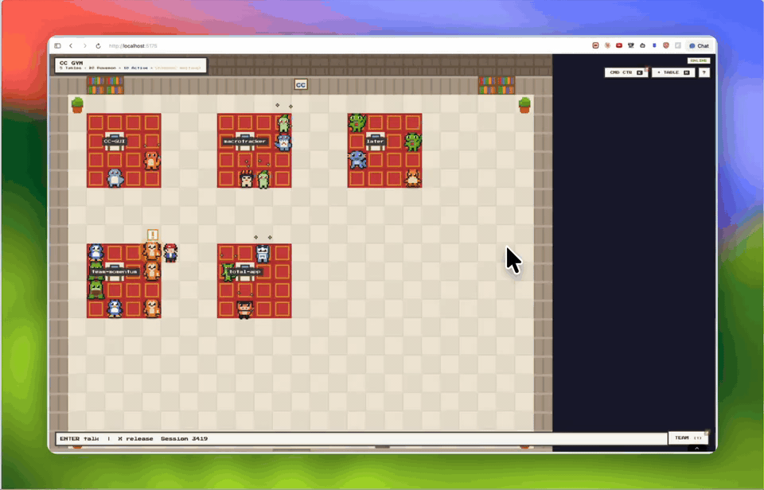

# CC-GUI

A retro-themed dashboard for managing multiple [Claude Code](https://docs.anthropic.com/en/docs/claude-code) CLI sessions in parallel. Spawn sessions per project, watch them work in a card grid, and jump into any terminal when one needs your attention.

## Demo



Full-quality video: [cc-gui-demo.mov](docs/media/cc-gui-demo.mov)

## What it does

- **Projects ("Tables")** — each project points to a directory on your machine
- **Sessions ("Pokémon")** — each session runs `claude` (or any command) in that project's directory via a real PTY
- **Agent grid** — the main view shows every session for the selected project as a card, sorted by priority (urgent → waiting → working → idle), with live state, summary, branch info, and PR controls
- **Activity sidebar** — always-visible rail on the right with alerts and a cross-project priority queue; click any item to jump into its terminal
- **Terminal overlay** — full xterm.js terminal with mobile support, session swipe/switch, and one-tap restart
- **Project discovery** — scans your local git repos and GitHub account so you can add projects in one click

## How it's laid out

```
 ┌──────────────────────────────────────────────────────────────┐
 │ HUD   CC GYM · SAFE MODE · stats · [project tabs]  [+ TABLE] │
 ├────────────────────────────────────────┬─────────────────────┤
 │                                        │                     │
 │   AGENT GRID                           │   ACTIVITY SIDEBAR  │
 │   (cards for the active project,       │   · Alerts          │
 │    sorted by priority)                 │   · Queue           │
 │                                        │     (all projects)  │
 │                                        │                     │
 └────────────────────────────────────────┴─────────────────────┘
              click a card → full-screen terminal overlay
```

The server spawns each session as a real PTY via `node-pty` and streams output over Socket.IO. A server-side orchestrator strips ANSI, detects Claude's prompt/waiting states, and broadcasts a priority ranking that drives the grid order, card accents, and sidebar queue.

## Setup

### Prerequisites

| Dependency | Required | Purpose |
|-----------|----------|---------|
| [Node.js](https://nodejs.org/) 18+ | Yes | Runtime for the server and build tools |
| [Claude Code CLI](https://docs.anthropic.com/en/docs/claude-code) | Yes | The `claude` command that sessions run by default |
| [GitHub CLI](https://cli.github.com/) (`gh`) | No | Enables GitHub repo discovery in the project picker |

**Verify your setup:**

```bash
node --version    # Should print v18.x or higher
claude --version  # Should print the Claude Code version
gh auth status    # Optional — should show "Logged in" if you want GitHub discovery
```

`node-pty` compiles native code, so you also need a C/C++ toolchain. On macOS: `xcode-select --install`. On Linux: `build-essential` and `python3`.

### Installation

```bash
git clone https://github.com/Haroutkhac/CC-GUI.git
cd CC-GUI
npm install
cp data/store.example.json data/store.json
```

### Running in development

```bash
npm run dev
```

This starts two processes concurrently:
- **API server** on `http://localhost:3456` — Express + Socket.IO, manages terminals
- **Vite dev server** on `http://localhost:5173` — React frontend with hot reload

Open **http://localhost:5173** in your browser.

### Running in production

```bash
npm run build    # Build the React frontend into dist/
npm start        # Server serves both API and static frontend on :3456
```

### Authentication

CC-GUI protects all `/api/*` routes and Socket.IO connections with a local auth token.

- On first launch the server creates `~/.cc-gui/auth-token`.
- The frontend fetches it from `/api/auth-token` (localhost only).
- For remote dev or custom clients, set `VITE_AUTH_TOKEN` to the token value.

## Safe mode

CC-GUI starts in `OPENAI_SAFE_MODE=true` by default. This is the recommended posture — the app spawns real shells, so you only want it reachable from your own machine.

What safe mode enforces:

- Server binds to `127.0.0.1` (loopback only)
- CORS restricted to explicit local origins
- Auto-respond starts disabled
- Sessions running protected agent commands (e.g. `codex`, `openai`) require manual approvals
- A `SAFE MODE ON` banner renders in the HUD so the state is always visible

Relevant environment variables:

```bash
OPENAI_SAFE_MODE=true
HOST=127.0.0.1
ALLOWED_ORIGINS=http://localhost:5173,http://127.0.0.1:5173
ALLOW_UNSAFE_REMOTE=false
PROTECTED_AGENT_COMMANDS=codex,openai
DEFAULT_SESSION_COMMAND=claude
```

Setting `HOST` to a non-local address while safe mode is on fails startup unless `ALLOW_UNSAFE_REMOTE=true` is also set. To boot with Codex as the default command: `DEFAULT_SESSION_COMMAND=codex npm run dev` (you can still override the command per session).

## Usage

### 1. Add a project

Click **+ TABLE** in the top-right (or press `N`). The picker shows:

- **GITHUB** — repos from your GitHub account (requires `gh` CLI). Tagged `LOCAL` if already cloned, `REMOTE` if not.
- **LOCAL** — git repos found in your home directory (scans 3 levels deep).

Click any repo, or choose **ENTER PATH MANUALLY** to type an absolute path.

### 2. Switch between projects

The HUD shows one tab per project. Click a tab (or the `GALLERY` button for a swipeable view) to make it the active project — the agent grid updates to show its sessions.

### 3. Spawn a session

Press `S` to quick-spawn a session on the active project, or open `GALLERY` → `+` to name it and customize the command. Each session defaults to `DEFAULT_SESSION_COMMAND` (usually `claude`) in the project's directory; you can override with anything (`codex`, `bash`, `npm run dev`, etc.).

### 4. Open a terminal

Click any card in the agent grid. This opens a full-screen xterm.js terminal attached to the session's PTY — identical to running the command in your own shell. Type prompts, approve tool use, everything works. Swipe (mobile) or use the carousel to switch between sessions in the same project without closing.

### 5. Triage from the sidebar

The **Activity** sidebar on the right is always visible and aggregates across all projects:

- **Alerts** — dismissible notifications (errors, session state changes, conflicts)
- **Queue** — sessions ranked by priority

| Priority | Meaning | Example |
|----------|---------|---------|
| CRITICAL | Needs confirmation | Claude asking `(Y/n)` to approve a tool |
| HIGH | Waiting for input or errored | Claude showing the `>` prompt, or a failed command |
| MEDIUM | Task completed | Claude finished; output shows `Done` or `✓` |
| LOW | Actively working | Claude is thinking, reading files, writing code |

Click any queue item to jump straight into its terminal.

### Keyboard shortcuts

| Key | Action |
|-----|--------|
| `N` | New project |
| `S` | Spawn session on the active project |
| `1`–`9` | Jump to the Nth session in the priority queue |
| `ESC` | Close / back (closes dialogs, then terminal, then carousel) |

Shortcuts are disabled while typing in input fields and while a terminal is open (so your keystrokes go to the PTY). Click the `?` button in the HUD for a live reference.

### Tests

```bash
npm test
```

### Seed test data

```bash
node scripts/seed.js
```

## Architecture

```
scripts/
  seed.js               Populates sample projects and sessions for testing

server/
  index.js              Express + Socket.IO entrypoint, auth, wiring
  routes.js             REST API routes and handlers
  socket-handlers.js    Socket.IO event handlers
  auth.js               Shared secret auth token + middleware
  store.js              JSON file persistence (data/store.json)
  terminal-manager.js   node-pty wrapper for spawning and managing PTY processes
  orchestrator.js       Monitors terminal output and ranks sessions by priority
  ai-orchestrator.js    Summaries, PR diffs, auto-respond, coordination
  notification-wiring.js Notification + status broadcasts
  state-detector.js     PTY + transcript status detection
  transcript-watcher.js Claude transcript watcher
  summarizer.js         Session summaries
  conflict-detector.js  Conflict detection for sessions/branches
  pr-creator.js         PR creation helpers
  coordinator.js        Auto-coordination helpers
  utils.js              Safe mode config + command classification

src/
  App.jsx               Root component, state management, keyboard shortcuts
  main.jsx              Entry point
  hooks/useSocket.js    Socket.IO React hook (all server communication)
  components/
    HUD.jsx             Top bar: project tabs, stats, safe-mode banner, shortcut hints
    AgentGrid.jsx       Main grid — one card per session, sorted by priority
    ActivitySidebar.jsx Right-side rail with alerts and cross-project queue
    AlertsSection.jsx   Notification/alert list inside the sidebar
    TerminalOverlay.jsx xterm.js terminal emulator with mobile support
    SessionCarousel.jsx Swipeable session browser per project
    DialogBox.jsx       Project picker, new-session dialog, confirm dialogs
    MobileControls.jsx  Touch controls for mobile
    ErrorBoundary.jsx   Top-level error boundary
  styles/
    index.css           All styles (retro Pokémon-inspired theme)
```

**Data flow:** The React client talks to the Express server over Socket.IO. When you open a terminal, the server spawns a PTY via `node-pty` and streams its output into the session's Socket.IO room. The orchestrator listens to all terminal output server-side, strips ANSI codes, pattern-matches against Claude Code's prompt formats, and broadcasts priority rankings to every connected client.

## Troubleshooting

**`npm install` fails on `node-pty`**
You need a C/C++ compiler. macOS: `xcode-select --install`. Ubuntu/Debian: `sudo apt install build-essential python3`.

**`claude` command not found when opening a session**
The server adds `~/.local/bin` to the PATH for spawned processes. If your `claude` binary is elsewhere, check `which claude` and either symlink it or set the session command to the full path.

**Blank screen on load**
Make sure both the API server (`:3456`) and Vite (`:5173`) are running. `npm run dev` starts both. Check the terminal output for errors.

**GitHub repos not showing in project picker**
Install and authenticate the GitHub CLI: `gh auth login`.

**Server refuses to start with a non-local `HOST`**
That's safe mode doing its job. Set `ALLOW_UNSAFE_REMOTE=true` only if you understand the implications (see below).

## Security notice

This tool spawns real terminal processes and provides full shell access through the browser. It is designed for **local use only**.

- Safe mode defaults to `127.0.0.1` and explicit local origins only
- Disabling safe mode or allowing remote access makes the app materially riskier
- Anyone who can reach the server can execute arbitrary commands
- The `/api/discover` endpoint lists git repos on your machine
- **Do not expose this to the public internet**
- For protected-agent sessions (Codex/OpenAI), keep approvals manual and do not share access to a logged-in session
- Terminal scrollback and transcript-derived state may contain prompts, repo paths, and secrets; clean `data/scrollback/` regularly if you use protected-agent sessions

For remote access, use a VPN or [Tailscale](https://tailscale.com).

## License

MIT
